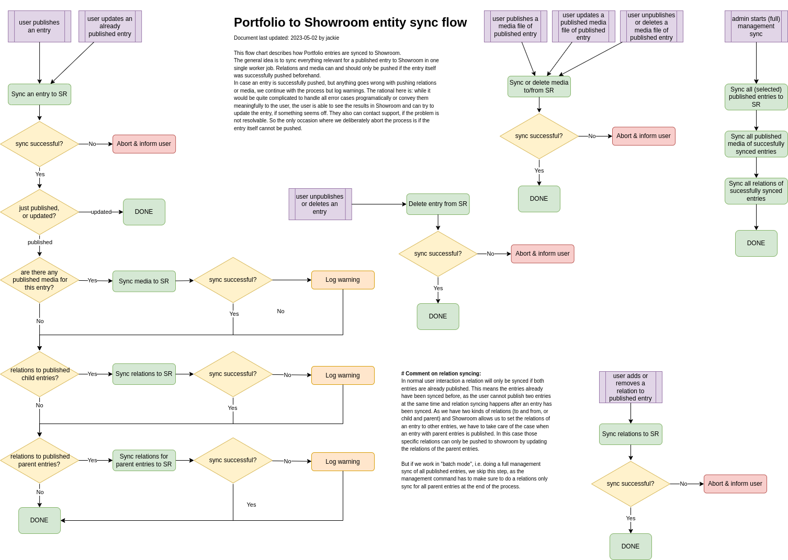

# Showroom Connection

When entries in Portfolio are published, they are synced to Showroom, including any attached media as well as
relations to other published entries. Whenever a published entry in Portfolio is updated, the change also has to be
synced to Showroom. Most importantly, whenever an entry is unpublished or deleted, its representation in Showroom has to
be deleted as well.

Syncing of Portfolio entries to Showroom is handled by worker jobs. So while this can be configured to happen
synchronously (as is the case by default in a local development environment), a production system will most probably
apply an asynchronous worker execution model. To get an overview of the different use cases for syncing Portfolio
entries and/or their attached media and relations to other entries, take a look at the following diagram:

(full-size image: 
drawio source: )

The syncing to Showroom is implemented in the `showroom_connector` app, which facilitates signals to Entry, Media, and
Relation updates to start worker jobs that handle the data transfer to or deletion from Showroom through the
[Showroom REST-API](https://showroom-backend.readthedocs.io/en/latest/rest_api.html).
